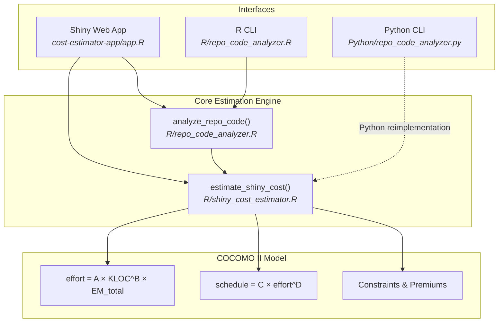
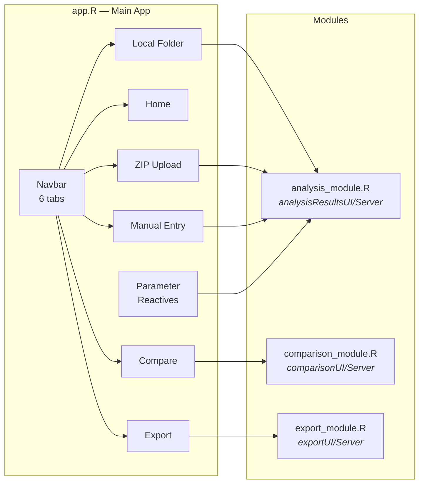
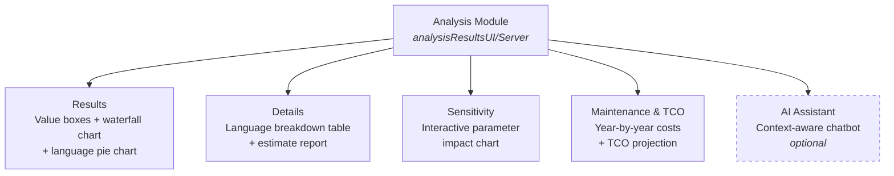
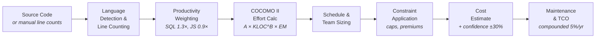
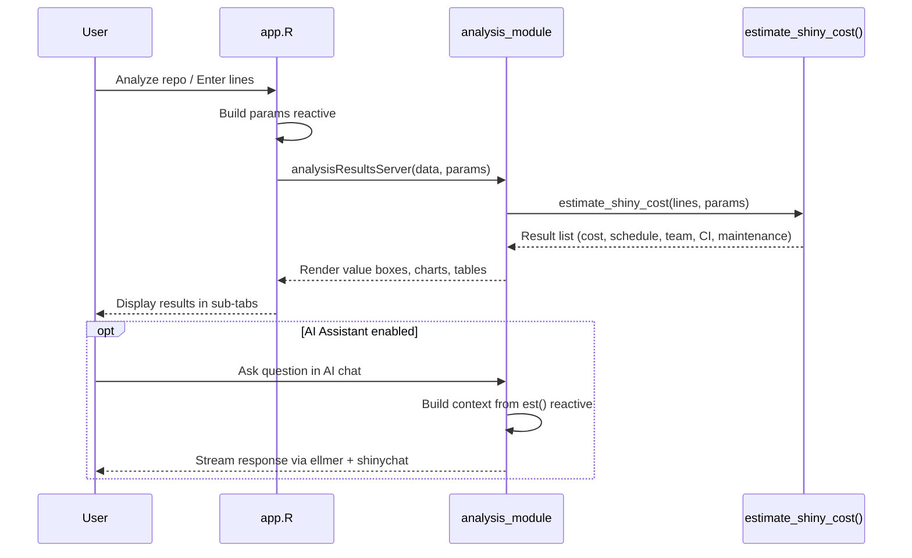

# Shiny App Valuation Toolkit

COCOMO II-based cost estimation for R Shiny and data science projects. Estimates development effort, schedule, team size, budget, maintenance costs, and Total Cost of Ownership (TCO) from code line counts and project parameters.

## Overview

Three interfaces, one estimation engine:

- **Shiny Web App** - Interactive dashboard with visualizations, AI assistant, scenario comparison, and export
- **R CLI** - `analyze_repo_code()` scans a repository and prints an scc-style report with cost estimate
- **Python CLI** - `repo_code_analyzer.py` with `analyze` and `estimate` subcommands, plus CSV/HTML/TXT export

## Quick Start

### Shiny App (recommended)

```bash
# Install dependencies
Rscript cost-estimator-app/check_dependencies.R

# Launch
Rscript cost-estimator-app/run_app.R
```

### R Command Line

```r
source("R/repo_code_analyzer.R")
analyze_repo_code(".", avg_wage = 105000, complexity = "medium", team_experience = 4)
```

### Python Command Line

```bash
# Analyze a repository
python3 Python/repo_code_analyzer.py analyze . --avg-wage 105000 --complexity medium

# Direct estimate from line count
python3 Python/repo_code_analyzer.py estimate --lines 10000 --complexity medium --team-exp 4

# With maintenance projection
python3 Python/repo_code_analyzer.py estimate --lines 10000 --maintenance-years 3
```

## Architecture

### High-Level System Architecture



### Shiny App Module Architecture



### Analysis Module Sub-tabs

Each analysis tab (Local Folder, ZIP Upload, Manual Entry) shares the same analysis module with five sub-tabs:



### COCOMO II Estimation Pipeline



### Data Flow



## How It Works

The COCOMO II parametric model:

```
Effort (person-months) = A × KLOC^B × EM_total

A     = 2.50 (base calibration)
B     = 1.02 - 1.18 (complexity exponent: low/medium/high)
KLOC  = thousands of lines of code, weighted by language productivity
EM    = product of effort multipliers (experience, reuse, tools, modern framework, COCOMO drivers)
```

Schedule is derived from effort via a power-law formula. Realistic constraints cap team size at min(max_team_size, 8) and schedule at max_schedule_months. Compressed timelines trigger premium multipliers (1.2x-2.0x). Teams of 6+ get a 10% coordination premium. Confidence intervals are +/- 30% of the realistic cost.

### Maintenance & TCO

When maintenance years > 0, the model projects ongoing costs:

- **Annual maintenance** = realistic_cost × maintenance_rate
- Costs **compound at 5% per year** to account for growing complexity and knowledge turnover
- **TCO** = build cost + total maintenance over the projection period

## Key Parameters

| Parameter | Range | Default | Description |
|---|---|---|---|
| `complexity` | low / medium / high | medium | Drives the exponent B |
| `team_experience` | 1-5 | 4 | 1=novice (+15%), 5=expert (-5%) |
| `reuse_factor` | 0.7-1.3 | 1.0 | Lower = more reuse |
| `tool_support` | 0.8-1.2 | 1.0 | Lower = better tooling |
| `avg_wage` | $50K-$300K | $105K | Annual developer salary |
| `max_team_size` | 1-10 | 5 | Hard cap on team (max 8 effective) |
| `max_schedule_months` | 3-36 | 24 | Schedule ceiling |
| `rely, cplx, ruse, pcon, apex` | varies | 1.0 | Advanced COCOMO II cost drivers |
| `maintenance_rate` | 0-0.40 | 0.20 | Annual maintenance as fraction of build cost |
| `maintenance_years` | 0-10 | 0 | Years to project maintenance (0 = disabled) |

## Features

### Interactive Dashboard

- **Hero KPI layout** with value boxes showing estimated cost, confidence range, schedule, team size, and TCO
- **Waterfall cost breakdown** chart showing how each COCOMO II multiplier contributes to the final estimate
- **Language distribution** pie chart from repository analysis
- **Sensitivity analysis** — interactive chart showing how cost varies with complexity and team experience
- **Dark theme** (Bootswatch Darkly) with Roboto font and Plotly charts styled for dark backgrounds

### Three Analysis Modes

- **Local Folder** — browse to a repository on your machine; files are scanned and counted automatically
- **ZIP Upload** — upload a `.zip` of any repository (max 50 MB); extracted in an isolated temp directory with path-traversal validation
- **Manual Entry** — enter line counts per language (R, Python, JavaScript, SQL, CSS, Other) for quick estimates

### AI Assistant (Optional)

An AI-powered chatbot embedded as a sub-tab within each analysis module. Each tab's chat instance has its own context built from that specific analysis's `est()` reactive, so the assistant references the actual numbers from that analysis.

- Powered by `ellmer` + `shinychat` (OpenAI `gpt-4.1-nano`)
- Graceful degradation: shows install instructions if packages are missing, setup instructions if no API key
- Module namespacing ensures independent chat instances with no ID collisions across tabs

**Setup:**

```r
# Install optional packages
install.packages(c("ellmer", "shinychat"))

# Set API key (in .Renviron or before launching)
Sys.setenv(OPENAI_API_KEY = "sk-...")
```

### Scenario Comparison

Compare up to 3 scenarios side-by-side in the Compare tab. Each scenario has independent parameter controls including tool support quality. Results are displayed in a comparative table.

### Export & Sharing

- **Shareable URLs** with proper protocol detection (http/https) and pre-filled Manual Entry parameters
- **CSV export** of analysis results
- **JSON export** for programmatic consumption

### In-App Documentation

- **User Guide** and **Release Notes** accessible via navbar buttons
- Context-sensitive `?` help buttons next to every sidebar parameter with detailed explanations

## Project Structure

```
shiny-app-valuation/
├── R/
│   ├── shiny_cost_estimator.R       # Core COCOMO II estimation engine
│   └── repo_code_analyzer.R         # Repository scanner + estimator
├── Python/
│   └── repo_code_analyzer.py        # Python CLI equivalent (full feature parity)
├── cost-estimator-app/
│   ├── app.R                        # Main Shiny app (~920 lines)
│   ├── run_app.R                    # Launcher script
│   ├── check_dependencies.R         # Dependency checker
│   ├── modules/
│   │   ├── analysis_module.R        # Shared results UI/server (5 sub-tabs)
│   │   ├── comparison_module.R      # Scenario comparison (up to 3)
│   │   ├── export_module.R          # URL sharing + CSV/JSON export
│   │   ├── shiny_cost_estimator.R   # Deployment fallback copy
│   │   └── repo_code_analyzer.R     # Deployment fallback copy
│   ├── markdown/
│   │   ├── user_guide.md            # In-app user guide
│   │   └── release_notes.md         # In-app release notes
│   └── www/
│       └── architecture_animation.html  # Interactive architecture visualization
├── tests/
│   ├── testthat.R                   # Test runner
│   └── testthat/
│       └── test-estimate_shiny_cost.R   # 59 tests
├── examples/
│   └── amira_case_study.md          # Real-world case study
├── CLAUDE.md                        # AI coding assistant instructions
├── LICENSE                          # MIT License
└── README.md
```

### Module Responsibilities

| Module | UI Function | Server Function | Purpose |
|---|---|---|---|
| `analysis_module.R` | `analysisResultsUI()` | `analysisResultsServer()` | Value boxes, waterfall chart, pie chart, details table, sensitivity chart, maintenance panel, AI assistant |
| `comparison_module.R` | `comparisonUI()` | `comparisonServer()` | Side-by-side scenario comparison with independent parameters |
| `export_module.R` | `exportUI()` | `exportServer()` | Shareable URL generation, CSV/JSON download |

### Source Resolution

The app sources estimation functions from `../R/` (project root) with a fallback to `modules/` copies for deployment environments where the parent directory is not available. When updating `R/shiny_cost_estimator.R` or `R/repo_code_analyzer.R`, copy the changes to `modules/` as well.

## Running Tests

```bash
Rscript tests/testthat.R
```

Requires the `testthat` package. The test suite (59 tests) covers:

- Return structure and required fields
- Known-input value ranges
- Complexity ordering (low < medium < high)
- Input validation and error handling
- Team size and schedule constraints
- Maintenance math and compounding
- Confidence interval bounds
- Multiplier breakdown consistency

## Dependencies

### Required

| Package | Purpose |
|---|---|
| `shiny` | Web application framework |
| `bslib` | Bootstrap 5 theming and layout |
| `plotly` | Interactive charts (waterfall, pie, sensitivity, maintenance) |
| `DT` | Interactive data tables |
| `shinyWidgets` | Enhanced UI widgets |
| `jsonlite` | JSON export |
| `RColorBrewer` | Color palettes for charts |

### Optional (AI Assistant)

| Package | Purpose |
|---|---|
| `ellmer` | LLM chat interface (OpenAI) |
| `shinychat` | Chat UI widget for Shiny |

Plus the `OPENAI_API_KEY` environment variable.

### Development

| Package | Purpose |
|---|---|
| `testthat` | Unit testing framework |

## Deployment

The Shiny app can be deployed to:

- **shinyapps.io** — upload the `cost-estimator-app/` directory (uses `modules/` fallback copies automatically)
- **Posit Connect / Shiny Server** — point to `cost-estimator-app/`
- **Docker** — install R + dependencies, copy the full project, expose the Shiny port

For deployment platforms, the `modules/` directory contains fallback copies of the core estimation files so the app works without access to the `../R/` parent directory.

## License

MIT License - see [LICENSE](LICENSE).

## Author

Alexis Roldan
