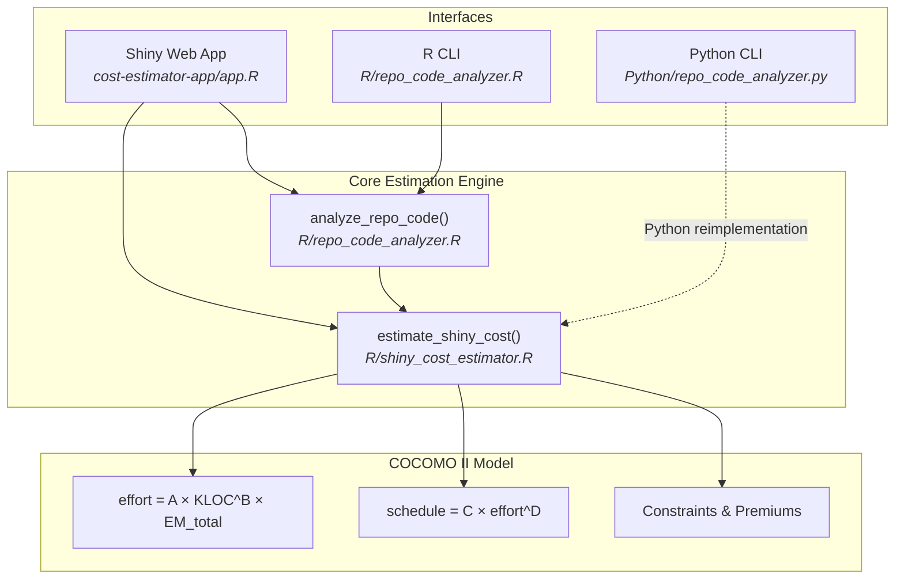
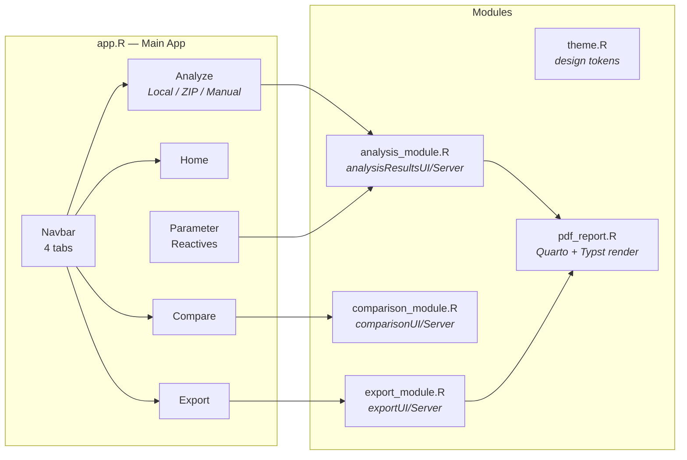
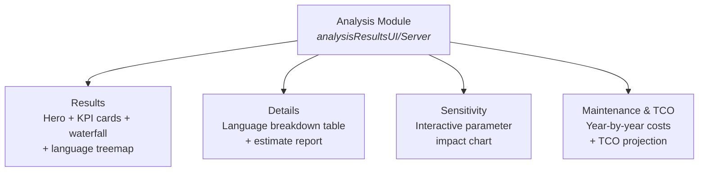
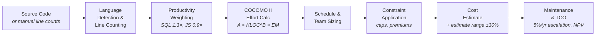
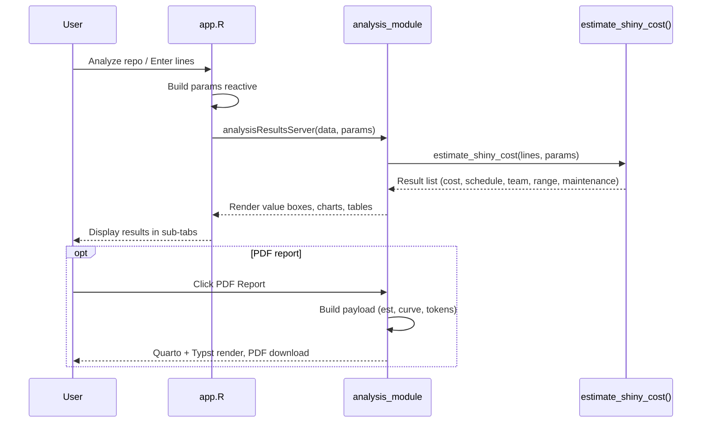

# Shiny App Valuation Toolkit

**v2.0.0** · COCOMO II-based cost estimation for R Shiny and data science projects. Estimates development effort, schedule, team size, budget, maintenance costs, and Total Cost of Ownership (TCO) from code line counts and project parameters.

## Overview

Three interfaces, one estimation engine:

- **Shiny Web App** - Interactive dashboard with visualizations, branded PDF reports, scenario comparison, and export
- **R CLI** - `analyze_repo_code()` scans a repository and prints an scc-style report with cost estimate
- **Python CLI** - `repo_code_analyzer.py` with `analyze` and `estimate` subcommands, plus CSV/HTML/TXT export. *Note: the Python port still implements the v1.x model and has not yet been updated to the v2.0 calibration (COCOMO II.2000 constants, smooth compression premium, single wage rate) — its numbers will differ from the app until it is ported.*

## Quick Start

### Shiny App (recommended)

```bash
# Install dependencies
Rscript cost-estimator-app/check_dependencies.R

# Launch
Rscript cost-estimator-app/run_app.R
```

### R Command Line

```r
source("R/repo_code_analyzer.R")
analyze_repo_code(".", avg_wage = 105000, complexity = "medium", team_experience = 4)
```

### Python Command Line

```bash
# Analyze a repository
python3 Python/repo_code_analyzer.py analyze . --avg-wage 105000 --complexity medium

# Direct estimate from line count
python3 Python/repo_code_analyzer.py estimate --lines 10000 --complexity medium --team-exp 4

# With maintenance projection
python3 Python/repo_code_analyzer.py estimate --lines 10000 --maintenance-years 3
```

## Architecture

### High-Level System Architecture


```mermaid
graph TB
    subgraph Interfaces
        APP["Shiny Web App<br/><i>cost-estimator-app/app.R</i>"]
        RCLI["R CLI<br/><i>R/repo_code_analyzer.R</i>"]
        PYCLI["Python CLI<br/><i>Python/repo_code_analyzer.py</i>"]
    end

    subgraph Core["Core Estimation Engine"]
        EST["estimate_shiny_cost()<br/><i>R/shiny_cost_estimator.R</i>"]
        SCAN["analyze_repo_code()<br/><i>R/repo_code_analyzer.R</i>"]
    end

    subgraph Model["COCOMO II Model"]
        FORMULA["effort = A × KLOC^B × EM_total"]
        SCHED["schedule = C × effort^D"]
        CONST["Constraints & Premiums"]
    end

    APP --> SCAN
    APP --> EST
    RCLI --> SCAN
    SCAN --> EST
    PYCLI -.->|"Python reimplementation"| EST

    EST --> FORMULA
    EST --> SCHED
    EST --> CONST
```

### Shiny App Module Architecture


```mermaid
graph LR
    subgraph app.R["app.R — Main App"]
        NAV["Navbar<br/>4 tabs"]
        PARAMS["Parameter<br/>Reactives"]
        NAV --> HOME["Home"]
        NAV --> AN["Analyze<br/><i>Local / ZIP / Manual</i>"]
        NAV --> COMP["Compare"]
        NAV --> EXP["Export"]
    end

    subgraph Modules
        TH["theme.R<br/><i>design tokens</i>"]
        AM["analysis_module.R<br/><i>analysisResultsUI/Server</i>"]
        CM["comparison_module.R<br/><i>comparisonUI/Server</i>"]
        EM["export_module.R<br/><i>exportUI/Server</i>"]
        PR["pdf_report.R<br/><i>Quarto + Typst render</i>"]
    end

    AN --> AM
    COMP --> CM
    EXP --> EM
    AM --> PR
    EM --> PR
    PARAMS --> AM
```

### Analysis Module Sub-tabs

The Analyze tab (Local Folder / ZIP Upload / Manual Entry input methods) shares one analysis module with four sub-tabs:


```mermaid
graph TB
    AM["Analysis Module<br/><i>analysisResultsUI/Server</i>"]

    AM --> R["Results<br/>Hero + KPI cards + waterfall<br/>+ language treemap"]
    AM --> D["Details<br/>Language breakdown table<br/>+ estimate report"]
    AM --> S["Sensitivity<br/>Interactive parameter<br/>impact chart"]
    AM --> M["Maintenance & TCO<br/>Year-by-year costs<br/>+ TCO projection"]
```

### COCOMO II Estimation Pipeline


```mermaid
flowchart LR
    A["Source Code<br/><i>or manual line counts</i>"] --> B["Language<br/>Detection &<br/>Line Counting"]
    B --> C["Productivity<br/>Weighting<br/><i>SQL 1.3×, JS 0.9×</i>"]
    C --> D["COCOMO II<br/>Effort Calc<br/><i>A × KLOC^B × EM</i>"]
    D --> E["Schedule &<br/>Team Sizing"]
    E --> F["Constraint<br/>Application<br/><i>caps, premiums</i>"]
    F --> G["Cost<br/>Estimate<br/><i>+ estimate range ±30%</i>"]
    G --> H["Maintenance<br/>& TCO<br/><i>5%/yr escalation, NPV</i>"]
```

### Data Flow


```mermaid
sequenceDiagram
    participant U as User
    participant App as app.R
    participant Mod as analysis_module
    participant Est as estimate_shiny_cost()

    U->>App: Analyze repo / Enter lines
    App->>App: Build params reactive
    App->>Mod: analysisResultsServer(data, params)
    Mod->>Est: estimate_shiny_cost(lines, params)
    Est-->>Mod: Result list (cost, schedule, team, range, maintenance)
    Mod-->>App: Render value boxes, charts, tables
    App-->>U: Display results in sub-tabs

    opt PDF report
        U->>Mod: Click PDF Report
        Mod->>Mod: Build payload (est, curve, tokens)
        Mod-->>U: Quarto + Typst render, PDF download
    end
```

## How It Works

The COCOMO II parametric model:

```
Effort (person-months) = A × KLOC^B × EM_total × 0.85

A     = 2.94 (COCOMO II.2000 calibration)
0.85  = documented modern-framework calibration (applied once)
B     = 1.02 - 1.18 (complexity exponent: low/medium/high)
KLOC  = thousands of billable lines, weighted by language productivity
        (docs/config files - Markdown, JSON, YAML, SVG... - are excluded)
EM    = product of effort multipliers (experience, reuse, tools, COCOMO drivers)

TDEV  = 3.67 × Effort^D,  D = 0.28 + 0.2 × (B − 0.91)
```

Realistic constraints cap team size at min(max_team_size, 8) and schedule at max_schedule_months. Compressed timelines carry a smooth premium (ratio^1.25, anchored to COCOMO II's SCED driver, capped at 2.0×), and plans that would exceed the team cap are flagged as infeasible. Teams of 6+ get a 10% coordination premium. The reported numbers are internally consistent: effort = team × schedule. The ±30% band is an estimate range (typical COCOMO II accuracy), not a statistical confidence interval.

### Maintenance & TCO

When maintenance years > 0, the model projects ongoing costs:

- **Annual maintenance** = build cost × maintenance_rate
- Costs **escalate at 5% per year** to account for growing complexity and knowledge turnover
- Multi-year totals are reported nominally **and discounted to present value** (default 5%/yr)
- **TCO** = build cost + maintenance present value

## Key Parameters

| Parameter | Range | Default | Description |
|---|---|---|---|
| `complexity` | low / medium / high | medium | Drives the exponent B |
| `team_experience` | 1-5 | 4 | 1=novice (+15%), 5=expert (-5%) |
| `reuse_factor` | 0.7-1.3 | 1.0 | Lower = more reuse |
| `tool_support` | 0.8-1.2 | 1.0 | Lower = better tooling |
| `avg_wage` | $50K-$300K | $105K | Annual developer salary |
| `max_team_size` | 1-10 | 5 | Hard cap on team (max 8 effective) |
| `max_schedule_months` | 3-36 | 24 | Schedule ceiling |
| `rely, cplx, ruse, pcon, apex` | varies | 1.0 | Advanced COCOMO II cost drivers |
| `maintenance_rate` | 0-0.40 | 0.20 | Annual maintenance as fraction of build cost |
| `maintenance_years` | 0-10 | 0 | Years to project maintenance (0 = disabled) |

## Features

### Interactive Dashboard

- **Hero estimate card** with the ±30% estimate range, plus unified KPI cards for code lines, schedule, team size, and effort/TCO
- **Waterfall cost breakdown** that totals exactly the headline cost, including schedule-compression and coordination steps
- **Language distribution** treemap (non-billable docs/config shown greyed out)
- **Sensitivity analysis** — curves that pass through your actual estimate, marker included
- **Branded PDF report** (Quarto + Typst) with cover, charts, assumptions, and methodology
- **Light professional theme** driven by a design-token layer (`modules/theme.R` + `www/custom.css`)

### Three Analysis Modes

- **Local Folder** — browse to a repository on your machine; files are scanned and counted automatically
- **ZIP Upload** — upload a `.zip` of any repository (max 50 MB); extracted in an isolated temp directory with path-traversal validation
- **Manual Entry** — enter line counts per language (R, Python, JavaScript, SQL, CSS, Other) for quick estimates

### Branded PDF Report

One click (Export tab or the summary strip) renders a 4-5 page client-ready PDF: cover with logo and headline estimate, KPI summary, waterfall and driver charts, schedule/TCO analysis, a full assumptions table, and a methodology page. Rendered with **Quarto + Typst** (`cost-estimator-app/report/`) — no LaTeX or Chrome required, works on shinyapps.io.

### Scenario Comparison

Compare up to 3 scenarios side-by-side in the Compare tab. Shared cost parameters (wage, max schedule) apply to all scenarios so dollar figures stay comparable; results appear as three-panel charts (cost with range bars, schedule, team) plus a table.

### Export & Sharing

- **PDF report** (see above)
- **Shareable URLs** with proper protocol detection (http/https) and pre-filled Manual Entry parameters; inbound parameters are validated and bounds-checked
- **CSV export** of analysis results
- **JSON export** for programmatic consumption

### In-App Documentation

- **How to Use** — a task-oriented user manual (first estimate, reading results, sharing) in a modal, written for non-technical users
- **User Guide** and **Release Notes** accessible via navbar buttons
- Context-sensitive `?` help buttons next to every sidebar parameter with detailed explanations

## Project Structure

```
shiny-app-valuation/
├── R/
│   ├── shiny_cost_estimator.R       # Core COCOMO II estimation engine
│   └── repo_code_analyzer.R         # Repository scanner + estimator
├── Python/
│   └── repo_code_analyzer.py        # Python CLI (v1.x model - pending v2.0 port)
├── cost-estimator-app/
│   ├── app.R                        # Main Shiny app
│   ├── run_app.R                    # Launcher script
│   ├── check_dependencies.R         # Dependency checker
│   ├── modules/
│   │   ├── theme.R                  # Design tokens (single source of truth)
│   │   ├── app_helpers.R            # Pure input-sanitizing helpers
│   │   ├── pdf_report.R             # Quarto + Typst PDF pipeline
│   │   ├── analysis_module.R        # Shared results UI/server (4 sub-tabs)
│   │   ├── comparison_module.R      # Scenario comparison (up to 3)
│   │   ├── export_module.R          # PDF / URL / CSV / JSON export
│   │   ├── shiny_cost_estimator.R   # BUILD ARTIFACT (synced from R/)
│   │   └── repo_code_analyzer.R     # BUILD ARTIFACT (synced from R/)
│   ├── report/                      # Branded PDF report (qmd + charts + fonts)
│   ├── markdown/
│   │   ├── user_guide.md            # In-app user guide
│   │   └── release_notes.md         # In-app release notes
│   └── www/
│       ├── custom.css               # Light theme (token-driven)
│       └── favicon.svg
├── tools/
│   ├── sync_modules.R               # Refresh modules/ engine copies
│   └── deploy.R                     # Sync + deploy to shinyapps.io
├── tests/
│   ├── testthat.R                   # Test runner
│   └── testthat/                    # ~180 assertions across 8 files
├── LICENSE                          # MIT License
└── README.md
```

### Module Responsibilities

| Module | UI Function | Server Function | Purpose |
|---|---|---|---|
| `analysis_module.R` | `analysisResultsUI()` | `analysisResultsServer()` | Hero + KPI cards, waterfall, treemap, driver chart, tradeoff curve, details, sensitivity, maintenance, summary strip + PDF button |
| `comparison_module.R` | `comparisonUI()` | `comparisonServer()` | Side-by-side comparison with shared cost parameters |
| `export_module.R` | `exportUI()` | `exportServer()` | PDF report, shareable URL generation, CSV/JSON download |

### Source Resolution

The app sources estimation functions from `../R/` (project root) with a fallback to `modules/` copies for deployment environments where the parent directory is not available. The `modules/` copies are **build artifacts**: refresh them with `Rscript tools/sync_modules.R` (never edit them by hand — a test fails if they drift), and deploy with `Rscript tools/deploy.R`, which syncs first.

## Running Tests

```bash
Rscript tests/testthat.R
```

Requires the `testthat` package. The suite (~180 assertions) covers:

- Golden-value regressions for the engine
- Model invariants: effort = team × schedule, cost continuity in the schedule cap, exact wage linearity
- Input validation (including wage/team/schedule/discount-rate bounds)
- Maintenance math, 5%/yr escalation, and present-value discounting
- Estimate-range bounds and multiplier-breakdown consistency
- Analyzer billable classification (docs/config never move the estimate)
- Manual-entry sanitization helpers and URL parameter parsing
- A `testServer` smoke test and an end-to-end PDF render
- Engine/modules file-sync drift detection

## Dependencies

### Required

| Package | Purpose |
|---|---|
| `shiny` | Web application framework |
| `bslib` | Bootstrap 5 theming and layout |
| `plotly` | Interactive charts (waterfall, treemap, sensitivity, maintenance) |
| `DT` | Interactive data tables |
| `markdown` | In-app User Guide / Release Notes |
| `jsonlite` | JSON export |
| `quarto` | PDF report rendering (needs Quarto CLI ≥ 1.3; Typst is bundled) |
| `ggplot2`, `knitr`, `ragg` | Static charts and tables inside the PDF report |

### Development

| Package | Purpose |
|---|---|
| `testthat` | Unit testing framework |

## Deployment

The Shiny app can be deployed to:

- **shinyapps.io** — upload the `cost-estimator-app/` directory (uses `modules/` fallback copies automatically)
- **Posit Connect / Shiny Server** — point to `cost-estimator-app/`
- **Docker** — install R + dependencies, copy the full project, expose the Shiny port

For deployment platforms, the `modules/` directory contains fallback copies of the core estimation files so the app works without access to the `../R/` parent directory.

## License

MIT License - see [LICENSE](LICENSE).

## Author

Alexis Roldan
