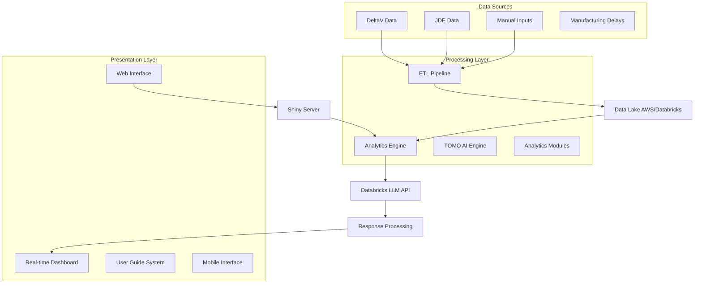

# 🚀 {AMIRA} - Advanced Manufacturing Insights & Real-time Analytics

<div align="center">


**AI-Powered Manufacturing Analytics Platform for Process Optimization**

*Los Angeles Plant - Takeda Pharmaceuticals*

[](https://github.com/oneTakeda/gms-ds-la-amira)
[](https://github.com/oneTakeda/gms-ds-la-amira)
[](https://www.r-project.org/)
[](https://shiny.rstudio.com/)
[](https://databricks.com/)
[](https://github.com/oneTakeda/gms-ds-la-amira)

</div>

## 📋 Table of Contents

- [Overview](#-overview)
- [Features](#-features)
- [Architecture](#-architecture)
- [Project Structure](#-project-structure)
- [Installation](#-installation)
- [Usage](#-usage)
- [User Guide](#-user-guide)
- [Technical Details](#-technical-details)
- [Contributing](#-contributing)
- [License](#-license)

## 🎯 Overview

**{AMIRA}** is an advanced AI-powered manufacturing analytics platform designed to revolutionize process optimization and decision-making at the Takeda Los Angeles Plant. The application leverages cutting-edge artificial intelligence to provide near-real-time insights, predictive analytics, and intelligent automation across comprehensive manufacturing datasets.

### Key Benefits

- 🔍 **Near-Real-time Insights**: Get immediate analysis from complex manufacturing data with 15-minute refresh cycles
- 📊 **Comprehensive Coverage**: Analyze data across multiple process streams for complete visibility
- 🤖 **AI-Powered Intelligence**: Uses Databricks Claude Sonnet 4 with 70% token optimization and unified streaming interface
- 🎤 **Voice Input & Mobile-First**: Hands-free query input optimized for gloved operators with enhanced modal layouts (+17% desktop space, +3vh mobile)
- ✅ **Verified Calculations**: Mandatory double-check protocol ensures statistical accuracy across all LLM responses
- 💰 **Cost-Optimized Analytics**: Hybrid RAG architecture reduces token consumption while preserving analytical depth
- 🏭 **Plant-Specific Solutions**: Tailored operations with automatic batch ID recognition, sublot classification, and shift transition tracking
- 🔒 **Enterprise Security**: Built with enterprise-grade security, data privacy, and multi-site deployment architecture
- ⚡ **Process Optimization**: Proactive bottleneck identification with manufacturing-focused query systems
- 🎓 **Rapid Onboarding**: 5-minute Quick Start Tutorial and comprehensive documentation for enterprise adoption

## ✨ Features

### 🚀 Core Capabilities
- **Multi-Process Analytics**: FP002, FP005, G-Cent standard work optimization with shift transition tracking
- **Tier 2 Agentic BI Dashboard**: AI-powered constraint identification with real-time performance monitoring and TOMO GenAI integration for intelligent insights and predictive analytics
- **Enhanced FP005 Filtration Analysis**: Comprehensive four-step role card tracking (Media Set-up, Filtration Start-End, Harvest Operations, Cleaning Procedures) with cross-role card performance correlation
- **C3ME JDE Commodity Integration**: Financial and transactional data reconciliation with 59% deviation reduction
- **Delay Analytics**: Root cause analysis and prevention strategies using text analytics (21 hidden delays discovered)
- **Agentic BI Dashboards**: AI-powered dynamic visualization with TOMO intelligence and streaming responses
- **Near-real-time Monitoring**: 15-minute data refresh with continuous analytics and proactive alerting
- **Enterprise Onboarding Suite**: Quick Start Tutorial, Use Cases, Technical Architecture, and FAQ for rapid adoption

### Advanced AI Features
- **{TOMO} AI Assistant**: Hybrid RAG architecture combining summary statistics with semantic vector search. Pre-filters by equipment and search type, post-filters by date range (works around API limitations). Supports natural language date parsing ("last month", "last week") and provides context-aware manufacturing insights with 70% token reduction. **NEW v1.8.9**: Voice input (Beta) enables hands-free queries for gloved operators with review-before-send workflow. **NEW v1.8.8**: Mandatory calculation verification with double-check protocol ensures statistical accuracy.
- **TOMO Vision Chatbot**: Multi-modal intelligence analyzing plots, data tables, and text simultaneously. Enhanced with hybrid RAG approach providing summary statistics (20th/50th/90th percentiles by plasma type) plus semantically-relevant historical context from vector database for comprehensive visual analytics
- **Unified Streaming Interface**: create_streaming_wrapper() and standard_stream_error_handler() functions achieve 52% code reduction in chatbot module and 46% reduction in vision modal while standardizing error handling across all LLM interactions
- **Token Optimization Breakthrough**: Achieved up to 70% reduction in LLM token usage through hybrid RAG approach - replaces full data table prompts (2000-3000 tokens) with summary statistics + vector DB context (700-1000 tokens) while preserving analytical depth
- **Centralized RAG Architecture**: Consolidated all RAG functions into shared `pims_rag_helper_functions.R` module with 10 core functions including vector search, post-search filtering, date extraction, equipment parsing, and summary statistics generation for maintainable, consistent RAG operations across all modules
- **TOMO Vision MVDA Integration**: Multivariate Data Analysis capabilities for role card performance analysis, enabling systematic outlier detection and advanced pattern recognition
- **Advanced Batch Processing Logic**: Automatic detection of Source lots (LBXXXXXX), Recovered lots (LRXXXXXX), and sublot configurations. Hybrid RAG filtering strategy: equipment and search_type filtered PRE-search in Databricks API, date ranges filtered POST-search client-side (workaround for API limitations with DATE column range operators)
- **Advanced System Prompt Engineering**: Comprehensive data structure documentation with manufacturing-specific analysis guidelines for start-to-ready-to-start cycles
- **Predictive Analytics**: Time series analysis with anomaly detection and forecasting
- **Intelligent Automation**: Automated alert systems and optimization recommendations
- **Text Analytics**: Advanced pattern recognition and seasonal variation analysis
- **Calendar Process Heatmap**: Resource utilization patterns and constraint identification

### User Experience
- **📖 Interactive User Guide**: Built-in comprehensive training materials with theme-neutral background colors for dark/light mode compatibility
- **🎨 Branded Interface**: Professional Takeda styling and responsive design with enhanced daily workflow integration
- **📱 Mobile Responsive**: Access from any device with optimized modal layouts (94vh height, 3vh more bottom space for thumb reach)
- **🎤 Voice Input (Beta)**: Hands-free query input with Web Speech API for gloved operators, includes review-before-send workflow
- **⚡ Quick Actions**: One-click dataset-specific queries reduce typing by >50% (8 shortcuts across Tier 2 and TDF datasets)
- **⚡ High Performance**: Optimized for fast analysis and near-real-time updates
- **🔐 Role-Based Access**: Secure authentication with granular permissions
- **🔍 Enhanced Analytics**: Comprehensive documentation of new Tier 2 Agentic BI features with takt time compliance monitoring

## 🎯 Proven Results

### Success Stories & Impact

#### Quantifiable Improvements
- **59% Deviation Reduction**: JDE discrepancy deviations reduced from 2.2 to 0.9 events per month ($150K+ annual savings)
- **Process Delay Identification**: Discovered 21 gasket cleaning delays in 2 months (previously undetected)
- **FP002 Optimization**: AI-powered text analytics identified manual cleaning constraints, led to equipment design improvement reducing cleaning time by 30%
- **Shift Transition Analytics**: Comprehensive tracking of multi-shift operations (e.g., 'Weekend Swing to Weekend Grave') capturing previously invisible patterns
- **Night Shift Excellence**: Manufacturing teams use Agentic BI for weekly tracking and TOMO for shift-by-shift analysis in Monthly Standard Work meetings
- **Token Efficiency**: 70% reduction through hybrid RAG (2000-3000 → 700-1000 tokens)
- **Code Efficiency**: 52% reduction in streaming code through unified interface

#### Key Achievements
- **Hybrid RAG Architecture Breakthrough**: 70% token reduction (2000-3000 → 700-1000 tokens) through summary statistics + vector database context while improving analytical depth
- **Proactive Problem Detection**: Shift from reactive to predictive maintenance with AI-powered insights
- **Cross-System Visibility**: Unified view across DeltaV, C3ME JDE, and manual processes
- **24/7 Intelligent Support**: TOMO provides continuous assistance with context-aware responses
- **Centralized RAG Functions**: Consolidated 10 core RAG functions into shared module for consistent, maintainable AI operations across all dashboards

## 🚀 Quick Start

### New Users

1. **Access AMIRA**: Navigate to the application URL and log in with Takeda credentials
2. **Quick Start Tutorial**: Go to Info menu → Quick Start Tutorial for interactive 5-minute walkthrough
3. **Explore Use Cases**: Review real success stories (59% deviation reduction, $150K+ savings) in Info → Use Cases
4. **Ask TOMO**: Click red chatbot button and try: *"Show me FP002 performance this week"*
5. **Analyze Charts**: Generate any chart, click eye icon for Vision AI analysis

### Site Deployment Teams

1. **Review Architecture**: Info → Technical Architecture for system design and technology stack
2. **Check Requirements**: R 4.3.2+, Databricks workspace, RStudio Connect, data source APIs
3. **Estimate Costs**: ~$20K-30K annual (Databricks compute, Claude API, RStudio Connect)
4. **Review FAQ**: Info → FAQ for deployment questions and troubleshooting
5. **Contact Support**: alexis.roldan@takeda.com for customization consulting

**Estimated Setup Time**: 2-4 weeks for full deployment with data integration

## 🏗️ Architecture

### System Design



### Data Flow
1. **Data Ingestion**: Multi-source data from DeltaV, JDE, and manual inputs
2. **ETL Processing**: Real-time data transformation and validation
3. **AI Analysis**: Advanced analytics through Databricks LLM integration
4. **User Interaction**: Natural language queries processed through TOMO
5. **Real-time Updates**: Dynamic dashboards with live data streaming
6. **Intelligent Insights**: AI-generated recommendations and alerts

## 📁 Project Structure

```
gms-ds-la-amira/
├── README.md                        # This comprehensive guide
├── gms-ds-la-PIMS.Rproj            # RStudio project configuration
├── .gitignore                       # Git ignore patterns
├── .vscode/                         # VS Code configuration
│
├── app/                             # Main Shiny Application
│   ├── global.R                     # Global variables and data loading
│   ├── ui.R                         # User interface definition
│   ├── server.R                     # Server logic and event handling
│   │
│   ├── modules/                     # Modular R functions
│   │   ├── pims_poc_chatbot_module.R          # 🤖 TOMO AI Assistant
│   │   ├── pims_rag_helper_functions.R        # Centralized RAG functions (NEW)
│   │   ├── pims_llm_rag_function.R            # LLM Vision with Hybrid RAG
│   │   ├── pims_deltaV_fp*_std_wrk_module.R   # Standard Work Analytics
│   │   ├── pims_deltaV_tier2_module.R         # Tier 2 Bottleneck Analysis
│   │   ├── pims_deltaV_jde_commodity_*.R      # JDE Integration Modules
│   │   ├── pims_dashboard_alyt_module.R       # Agentic BI Dashboard
│   │   └── pims_functions.R                   # Core utility functions
│   │
│   ├── markdown/                    # Documentation and AI prompts
│   │   ├── chatbot_sys_prompt.md              # TOMO system prompts
│   │   ├── *_data_description.md              # Data schema documentation
│   │   └── *.md                               # Feature documentation
│   │
│   ├── www/                         # Static web assets
│   │   ├── styles.css                         # Custom CSS styling
│   │   ├── takeda_logo.png                    # Corporate branding
│   │   └── assets/                            # Additional resources
│   │
│   └── rds/                         # Cached data storage
│       └── *.RDS                              # Processed datasets
│
├── guidance/                        # User Documentation & Training
│   ├── README.md                              # Documentation overview
│   ├── amira_user_guide.Rmd                  # Master documentation
│   ├── quick_reference.Rmd                   # Quick start guide
│   ├── generate_docs.R                       # Documentation generator
│   └── styles.css                            # Documentation styling
│
├── etl/                             # Data Pipeline & Processing
│   └── pims_deltaV_jde_etl.qmd               # ETL documentation
│
├── test/                            # Testing Framework
│   ├── test_llm_chatbot.R                    # AI functionality tests
│   ├── run_tests.R                           # Test execution script
│   └── README.md                             # Testing documentation
│
├── figs/                            # Screenshots and demos
│   ├── *.gif                                 # Feature demonstrations
│   └── *.png                                 # Documentation images
│
└── sandbox/                         # Development & Experiments
    ├── slides/                               # Presentation materials
    └── tests/                                # Experimental features
```

### Key Files Description

| File | Purpose | Key Features |
|------|---------|--------------|
| `global.R` | Application initialization | Data loading, module sourcing, environment setup |
| `ui.R` | User interface | Responsive design, modular layout, branded styling |
| `server.R` | Application logic | Event handling, real-time processing, AI integration |
| `pims_poc_chatbot_module.R` | TOMO AI Assistant | Natural language processing, uses shared RAG functions |
| `pims_rag_helper_functions.R` | Centralized RAG Functions | Vector search, post-search filtering, date extraction, summary stats |
| `pims_llm_rag_function.R` | Hybrid RAG Vision | Multi-modal analysis, summary stats + vector DB context |
| `pims_dashboard_alyt_module.R` | Analytics Engine | Real-time metrics, predictive models, visualization |

## 🚀 Installation

### Prerequisites

- **R** (≥ 4.0.0)
- **RStudio** (recommended for development)
- **Required R Packages**:
  ```r
  install.packages(c(
    "shiny", "shinydashboard", "shinyWidgets", "shinychat",
    "DT", "plotly", "dplyr", "ggplot2", "lubridate",
    "knitr", "rmarkdown", "testthat", "ellmer"
  ))
  ```

### Environment Setup

1. **Clone Repository**:
   ```bash
   git clone https://github.com/oneTakeda/gms-ds-la-amira.git
   cd gms-ds-la-amira
   ```

2. **Configure Environment Variables**:
   ```r
   # Set in your .Renviron file:
   AWS_ACCESS_KEY_ID="your_aws_key"
   AWS_SECRET_ACCESS_KEY="your_aws_secret"  
   AWS_DEFAULT_REGION="us-east-1"
   dbx_wkspace="your_databricks_workspace"
   dbx_uc_pwd="your_databricks_token"
   ```

3. **Launch Application**:
   ```r
   # From RStudio or R console:
   setwd("app")
   shiny::runApp(".")
   
   # Or directly:
   shiny::runApp("app/", port = 3838)
   ```

## 💡 Usage

### Quick Start

1. **Launch AMIRA**: Open the application in your browser
2. **Explore Modules**: Navigate through analytics dashboards  
3. **Interact with TOMO**: Use the AI assistant for insights
4. **Access Documentation**: Click the "📖 User Guide" for detailed instructions

### Example Use Cases

#### Standard Work Analysis
```
- Monitor FP002/FP005 performance metrics
- Identify bottlenecks in G-Cent operations
- Track role card completion times
- Analyze shift-based performance variations
```

#### AI-Powered Insights with TOMO
```
- "Show me today's production delays"
- "Analyze FP005 performance trends"
- "Compare day vs night shift efficiency"
- "Identify recurring bottlenecks"
```

#### Process Optimization
```
- Real-time Tier 2 constraint analysis
- JDE commodity reconciliation
- Predictive maintenance insights
- Cost optimization recommendations
```

## 📖 User Guide

### Understanding the Interface

#### Main Navigation
The AMIRA interface is organized into intuitive modules:
- **🏠 Main Dashboard**: Overview of key performance indicators
- **📊 Standard Work Analytics**: FP002, FP005, G-Cent analysis
- **🔍 Tier 2 Analytics**: Bottleneck identification and resolution
- **💰 JDE Commodity**: Financial integration and reconciliation
- **🤖 TOMO AI Assistant**: Natural language interaction
- **📈 Agentic BI Dashboard**: Real-time monitoring and insights

#### Best Practices

##### ✅ Effective Usage
- **Start with Overview**: Check main dashboard for alerts and KPIs
- **Be Specific**: Use equipment names and time ranges in queries
- **Explore Interactively**: Click charts and tables for detailed views
- **Ask TOMO**: Use natural language for complex questions

##### 🚀 Advanced Features
- **Real-time Updates**: Data refreshes automatically every 15 minutes
- **Mobile Access**: Full functionality on tablets and smartphones
- **Export Capabilities**: Download data and visualizations
- **Custom Filters**: Personalize views by date, shift, equipment

#### Getting Help
- **📖 Built-in Documentation**: Comprehensive user guide accessible anytime
- **🎥 Video Tutorials**: Step-by-step training materials
- **💬 TOMO Assistant**: AI-powered help for questions
- **📞 Technical Support**: Contact alexis.roldan@takeda.com

## � Technical Details

### Technology Stack

#### 🛠️ Core Technologies
- **Frontend & Analytics**: R Shiny (Interactive web application), Plotly (Dynamic visualizations), DT (Advanced data tables), Quarto (Documentation & reporting)
- **Backend & Data**: Databricks (Data processing & ML), AWS (Cloud infrastructure), SQL Server, C3ME JDE, DeltaV (Process data integration)
- **AI & Machine Learning**: Large Language Models (LLM), Predictive modeling algorithms, Natural language processing, Real-time inference engines

#### 🔒 Security & Governance
- **Data Security**: Enterprise-grade encryption, Role-based access control, Audit trails and logging, Compliance with Takeda SDLC standards
- **Quality Assurance**: Comprehensive unit testing, Automated CI/CD pipelines, Code review processes, Performance monitoring
- **Scalability**: Modular architecture, Cloud-native design, Auto-scaling capabilities, Multi-environment support

### Performance Specifications
- **Response Time**: <3 seconds for dashboard updates
- **Data Freshness**: 15-minute refresh intervals for real-time data
- **Concurrent Users**: Supports 50+ simultaneous users
- **Uptime**: 99.5% availability with redundant systems
- **Security**: Enterprise authentication and role-based access

### API Integration
```r
# Example: Databricks LLM Integration
chat_databricks(
  workspace = Sys.getenv("dbx_wkspace"),
  system_prompt = "Analyze manufacturing data...",
  model = "databricks-meta-llama-3-1-405b-instruct", 
  token = Sys.getenv("dbx_uc_pwd"),
  api_args = list(temperature = 0)
)
```

## 🧪 Testing & Quality Assurance

AMIRA includes comprehensive testing capabilities:

```bash
# Run all tests
cd test/
R -e "source('run_tests.R'); run_chatbot_tests()"

# Run specific module tests  
R -e "testthat::test_file('test_llm_chatbot.R')"
```

**Test Coverage:**
- ✅ UI Component Testing
- ✅ Server Logic Validation  
- ✅ AI Chatbot Functionality
- ✅ Data Pipeline Integrity
- ✅ Error Handling & Recovery

## � Deployment

### Local Development
```r
# Launch in development mode
shiny::runApp("app/", port = 3838)

# Enable debugging
options(shiny.reactlog = TRUE)
shiny::runApp("app/")
```

### Production Deployment
- **Enterprise Hosting**: Deployed on internal Takeda infrastructure
- **High Availability**: Redundant systems with 99.5% uptime
- **Auto-scaling**: Dynamic resource allocation based on demand
- **Security**: Enterprise-grade authentication and encryption

### Performance Monitoring
- **Real-time Metrics**: Application performance tracking
- **Error Logging**: Comprehensive error capture and analysis
- **User Analytics**: Usage patterns and optimization insights
- **Health Checks**: Automated system monitoring and alerts

## 📈 Screenshots & Demos

### Tier 2 Analytics Dashboard


*Real-time bottleneck analysis with constraint identification*

### Standard Work Analytics


*Comprehensive FP002, FP005, and G-Cent performance monitoring*

### TOMO AI Assistant


*Natural language interaction with manufacturing data*

### Agentic BI Dashboard


*AI-powered dynamic visualization and insights*
## 🤝 Contributing

### Development Guidelines
1. **Fork** the repository
2. **Create** a feature branch (`git checkout -b feature/AmazingFeature`)
3. **Commit** changes (`git commit -m 'Add AmazingFeature'`)
4. **Push** to branch (`git push origin feature/AmazingFeature`)
5. **Open** a Pull Request

### Code Standards
- Follow R style guidelines (automated linting included)
- Add comprehensive comments and documentation
- Include unit tests for new functionality
- Update documentation for significant changes

### Adding New Features

#### Module Development
1. Create module files in `app/modules/`:
   ```r
   # my_new_module.R
   myModuleUI <- function(id) { ... }
   myModuleServer <- function(id) { ... }
   ```

2. Add to main UI/Server in `app/ui.R` and `app/server.R`

3. Create corresponding tests in `test/`

#### TOMO Enhancement
- Add new AI capabilities through `pims_llm_rag_function.R`
- Extend system prompts in `app/markdown/chatbot_sys_prompt.md`
- Test AI responses thoroughly before deployment

### Reporting Issues
- Use GitHub Issues for bug reports and feature requests
- Provide detailed reproduction steps
- Include system information and error messages
- Tag issues appropriately (bug, enhancement, question)

## 📞 Support

### Internal Support Channels

#### Technical Support
- **Primary Contact**: alexis.roldan@takeda.com
- **Response Time**: 4-6 hours for critical issues, 24 hours for standard
- **Emergency**: Available 24/7 for production-critical issues

#### Training Resources
- **📖 Documentation**: Comprehensive user guide in `/guidance` folder
- **🎥 Video Library**: Complete tutorial series accessible within AMIRA application
  - **AMIRA Tier 2 Analytics Guide**: Getting started with constraint analysis
  - **TOMO AI Assistant Masterclass**: Advanced chatbot features and tips
  - **Standard Work Analytics Guide**: FP002, FP005, and G-Cent analysis
  - **JDE Integration Tutorial**: C3ME JDE data and commodity analysis
  - **Agentic BI Dashboard**: Standard Work Dashboard powered by TOMO GenAI
  - **Mobile & Responsive Features**: Using AMIRA on different devices
- **🎓 Training Sessions**: Monthly group training available
- **👥 One-on-One**: Individual training sessions upon request

#### User Community
- **Internal Forums**: Takeda-specific discussion groups
- **Best Practices**: Monthly user meetups and knowledge sharing
- **Feature Requests**: Submit via GitHub issues or email
- **Success Stories**: Share improvements and achievements

### External Resources
- **📚 Technical Documentation**: Available in project `/docs` folder
- **🔗 API Documentation**: For advanced integrations and customizations
- **🛠️ Development Guides**: For contribution and customization requests
- **🏗️ Architecture Docs**: System design and technical specifications

## 📜 License

This project is proprietary software developed for Takeda Pharmaceuticals. All rights reserved.

**Internal Use Only** - Not for external distribution or commercial use.

---

<div align="center">

**Created by the GMS Data Science & Engineering Team - Los Angeles**

*Transforming Manufacturing Through AI-Powered Analytics*

[📧 Contact](mailto:alexis.roldan@takeda.com) | [🏢 Takeda](https://www.takeda.com) | [📊 GitHub](https://github.com/oneTakeda/gms-ds-la-amira)

**Last Updated:** November 2025 - Version 1.8.6

### 👥 Team & Acknowledgments

#### Core Development Team
- **Data Science - Los Angeles**: Lead Data Engineer & Scientist: Alexis Roldan

#### Business Stakeholders
- **Manufacturing Supervisors**: Jaime Rivera, Edwin Carrera, Olivias Cortez, Enrique Munoz, Manuel Castro, Kush Thukral
- **Manufacturing Management**: Evelio Martinez, Marie Lee
- **Operation Excellence Team**: Danielle Palmer, Pedro Quispe

#### Manufacturing Team
- **Manufacturing Leads**: Xavier Martinez, Vincencio Albert, Anthony Grajales, Alberto Rosas, Evelyn Sorianosos, Jafee Abitang

</div>